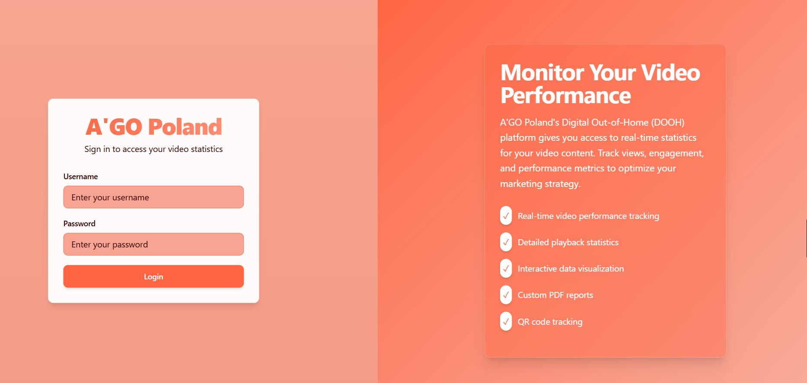

## 📌 Project 1: In-Taxi Video Ad Platform  
**Role:** Chief Technology Officer (CTO)  
**Company:** A'GO Poland (Startup)  
**Duration:** Dec 2024 – Present  
**Tech Stack:** Java, Spring Boot, REST APIs, SQL Server, FFmpeg, Windows, Git

**Description:**  
A complete backend platform that manages the delivery and monitoring of video advertisements displayed in taxi fleets across Poland. The system supports centralized scheduling, remote content updates, real-time health checks, and analytics reporting.

**Key Features & Responsibilities:**  
- 🔧 Designed and developed backend services using **Spring Boot** and **RESTful APIs**
- 🎯 Implemented dynamic ad scheduling, geo-targeting support, and device registration
- 📡 Built remote device monitoring tools with auto health checks and alerting
- 🧠 Integrated analytics tracking to measure ad play frequency and device uptime
- 🛠️ Deployed system updates and managed Windows-based in-car media systems
- 🤝 Led cross-functional collaboration between engineering and deployment teams
- 🔐 Developed tools to securely push content to devices and sync playback

**Screenshots & Architecture:**  

📸 More visuals available upon request

## 📌 Project 2: E-HELPER – Student Support Mobile App  
**Role:** Lead Developer  
**Type:** Academic Project (Wolaita Sodo University)  
**Tech Stack:** Java (Android), SQLite, FTP, XML, Android Studio

**Description:**  
E-HELPER is a mobile application designed to support the academic process at Wolaita Sodo University by solving real student problems. It enables students to view prerequisite courses, download assignments and course materials, view announcements, and track previously completed theses and research projects to reduce duplication. The app integrates with the university’s FTP server for content management.

**Key Features:**  
- 📚 View all university courses and their **prerequisites**  
- 🔔 **Student Alarm System**: Set and receive notifications for personal or class schedules  
- ⬇️ **Download assignments and materials** from university FTP server  
- 🗂 View previously submitted projects, research, and thesis work  
- 📢 In-app **announcement board** for course or university updates  
- 💾 **Offline local schedule storage** using SQLite  
- 👨‍🏫 Teachers can upload documents to a shared FTP server, accessible by students

**Challenges Addressed:**  
- Students enrolling in courses without meeting prerequisites  
- Lack of access to academic materials and e-books  
- Repetition of final projects and lack of originality in research  
- Inefficient communication between students and academic staff

**Limitations:**  
- Requires Wi-Fi connection for material downloads  
- Assignment submission through the app not supported

**Impact:**  
- Reduced academic friction and miscommunication  
- Encouraged digital literacy and self-management among students  
- Enhanced transparency in academic workflows

📂 _Source code available privately upon request_  
📧 Email [mulatudamtie21@gmail.com](mailto:mulatudamtie21@gmail.com) to request access or a demo.

## 📌 Project 3: Taxi Calling Management System (TCMS)  
**Role:** Full-stack Developer (Team Project)  
**Type:** BSc Graduation Project – Wolaita Sodo University  
**Tech Stack:** Android (Java), PHP, SQL Server, GPS, XML, Windows Server

**Description:**  
Taxi Calling Management System (TCMS) is a dual-platform solution (Android + Web) designed to automate the process of booking and dispatching taxis in the Wolaita Sodo area. It allows passengers to book a taxi anytime using a mobile app and enables administrators to assign taxis efficiently using a web dashboard. The system incorporates GPS to locate passengers and direct taxis, with a fare calculation feature based on distance traveled.

**Key Features:**  
- 📱 **Android App (Client Side):**
  - User registration and login
  - Pickup and destination selection via GPS
  - Request taxi functionality with time scheduling
  - Real-time taxi availability status
- 🌐 **Web Admin Panel:**
  - Assign available taxis to incoming requests
  - Register and manage driver/passenger profiles
  - Calculate fare based on tariff and route
  - Manage user comments and feedback
- 🔔 Notification system for ride status updates
- 🗂 SQL Server backend for storing user, trip, and fare data

**Motivation & Impact:**  
- Improved access to taxis for passengers, especially during night hours or in emergencies  
- Reduced reliance on manual taxi-booking methods  
- Increased transparency and efficiency in taxi dispatching  
- Inspired by transportation network systems like Uber, adapted to local needs

**Challenges Addressed:**  
- Manual booking delays and poor coverage during off-peak hours  
- Lack of accessible transport for disabled individuals  
- Unreliable fare negotiation and safety concerns for passengers  

**Team Members:**  
- Mulatu Berie  
- Fikadu Mengistu  
- Syoum Yimer  
- Mulu Wondimu  
- Alemitu Ayenew  

📅 Completed: December 2017  
📂 _Source code available privately upon request_  
📧 Email [mulatudamtie21@gmail.com](mailto:mulatudamtie21@gmail.com) to request access or a demo.

**Repo Access:**  
This repository is private due to business sensitivity. Please email [mulatudamtie21@gmail.com](mailto:mulatudamtie21@gmail.com) to request access or a detailed walkthrough.
